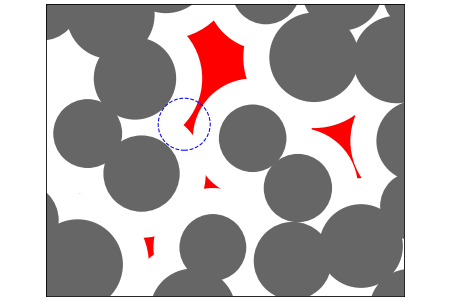

cavity-volumes-pbc
==================

This program calculates volume and surface area of cavities available for a given probe inside molecular dynamics models with periodic boundary conditions.

- fast analytical volume and surface computation for solvent-accessible voids 
- uses weighted Voronoi (power) diagram / regular triangulation, works with atoms of different radii
- input from GROMACS trajectory or simple text file
- optional 3D mesh output for visualization of voids, STL format viewable in VMD (experimental)

Build instructions
------------------
You will need [CGAL][1], [Boost][2] and [CMake][3] to build this software.

[1]: http://www.cgal.org/   "http://www.cgal.org"
[2]: http://www.boost.org/  "http://www.boost.org"
[3]: http://www.cmake.org/  "http://www.cmake.org"

### Quick start:
    $ git clone http://github.com/a-anik/cavity-volumes-pbc.git
    $ cd cavity-volumes-pbc
    $ mkdir build
    $ cd build
    $ cmake ..
    $ make

Usage
-----
`./cavity_volumes_pbc [run_control_file]`

Default run control filename: *cavity\_volumes\_pbc.inp*. Sample control files can be found in the *./examples* directory.

Known bugs
----------
- fails on very small and sparse configurations where periodic regular triangulation can't be built
- optional/experimental 3D mesh output works only for small isolated cavities

TODO
----
Switch to CGAL's native implementation of periodic regular triangulations ([CGAL::Periodic_3_regular_triangulation_3](https://doc.cgal.org/latest/Periodic_3_triangulation_3)) available since CGAL 4.11.

Citation
--------
1. S. Sastry, D.S. Corti, P.G. Debenedetti, F.H. Stillinger, "Statistical geometry of particle packings. I. Algorithm for exact determination of connectivity,
volume, and surface areas of void space in monodisperse and polydisperse sphere packings", Phys. Rev. E, V.56, N5, p. 5524, 1997. doi:[10.1103/PhysRevE.56.5524](http://dx.doi.org/10.1103/PhysRevE.56.5524)
2. Voloshin, V.P.; Anikeenko, A.V.; Medvedev, N.N.; Geiger, A., "An Algorithm for the Calculation of Volume and Surface of Unions of Spheres. Application for Solvation Shells," Eighth International Symposium on Voronoi Diagrams in Science and Engineering (ISVD), 2011, pp. 170-176. doi:[10.1109/ISVD.2011.30](http://dx.doi.org/10.1109/ISVD.2011.30)
